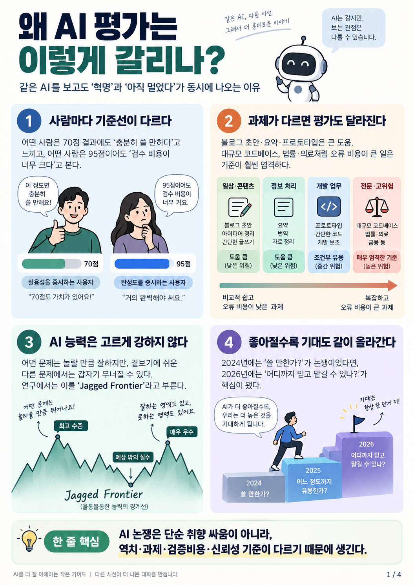
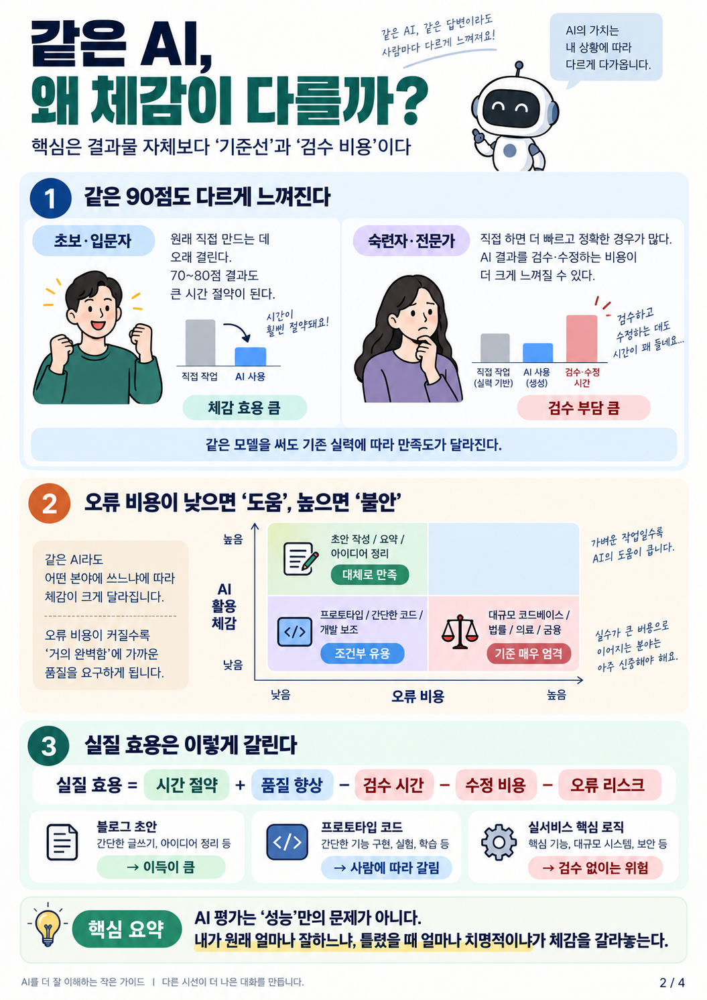
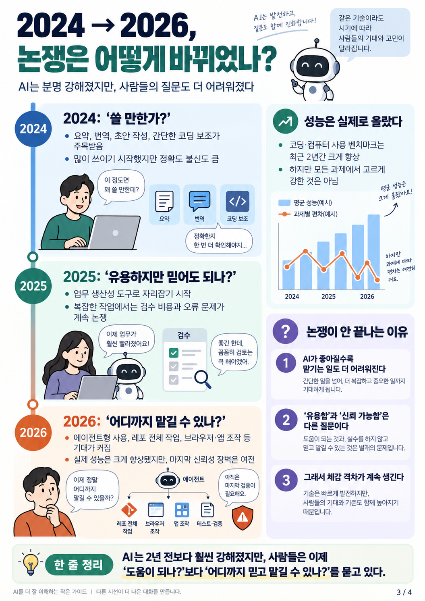
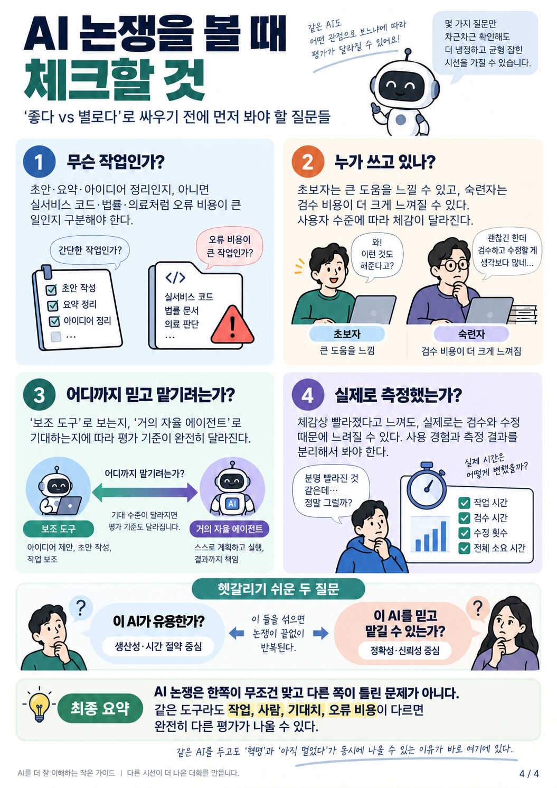

# 왜 AI 평가는 이렇게 갈리나?

같은 AI를 두고도 “혁명적이다”와 “아직 부족하다”가 동시에 나오는 이유를 **사용자 기준선, 과제 특성, 검수 비용, 신뢰성, 기대치 상승**으로 나눠 설명하는 4장짜리 가이드다.

## Pages

### 1. 왜 AI 평가는 이렇게 갈리나?

전체 프레임: 사람마다 기준선이 다르고, 과제별 오류 비용과 AI의 불균일한 능력 경계가 평가 차이를 만든다.

### 2. 같은 AI, 왜 체감이 다를까?

초보·숙련자 간 기준선 차이와 `시간 절약 + 품질 향상 - 검수/수정/오류 비용` 관점의 실질 효용을 설명한다.

### 3. 2024 → 2026, 논쟁은 어떻게 바뀌었나?

논쟁의 중심이 “쓸 만한가?”에서 “어디까지 믿고 맡길 수 있나?”로 이동한 흐름을 정리한다.

### 4. AI 논쟁을 볼 때 체크할 것

작업 종류, 사용자 숙련도, 기대하는 자율성 수준, 실제 측정 여부를 확인하는 실전 체크리스트다.

## Status

- Created: 2026-09-28
- Language: Korean
- Format: PNG, 1055×1491
- Pages: 4

## Caveat

이미지 속 일부 그래프와 막대는 개념 설명용 도식이다. 정량 수치를 직접 표현하는 그래프가 아니며, 근거가 필요한 핵심 배경 자료는 `SOURCES.md`를 참고한다.
