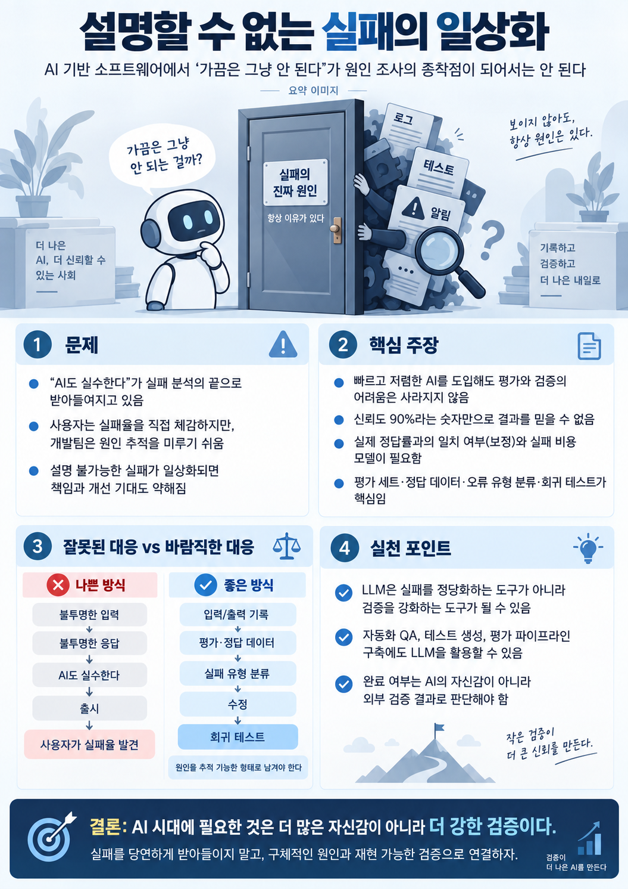

# 설명할 수 없는 실패의 일상화

AI 기반 소프트웨어에서 “가끔은 그냥 안 된다”를 실패 분석의 종착점으로 삼지 말아야 한다는 논지를 **평가, 보정, 원인 추적, 회귀 테스트, 외부 검증** 관점으로 요약한 1장짜리 가이드다.

## Pages

### 1. 설명할 수 없는 실패의 일상화

AI의 확률적 동작을 이유로 실패를 정상화하지 않고, 입력·출력 기록, 정답 데이터, 실패 유형 분류, 수정, 회귀 테스트로 연결해야 한다는 핵심 구조를 정리한다.

## Status

- Created: 2026-09-28
- Language: Korean
- Format: PNG, 1055×1491
- Pages: 1

## Caveat

이 이미지는 기사와 토론 내용을 개념적으로 요약한 인포그래픽이다. 정량 벤치마크나 특정 AI 모델의 실제 실패율을 측정한 그래프가 아니다. 이미지의 “신뢰도 90%” 표현은 신뢰도 점수를 검증 없이 실제 정답률로 해석하면 안 된다는 논점을 설명하기 위한 예시다. 근거와 원문은 `SOURCES.md`를 참고한다.
