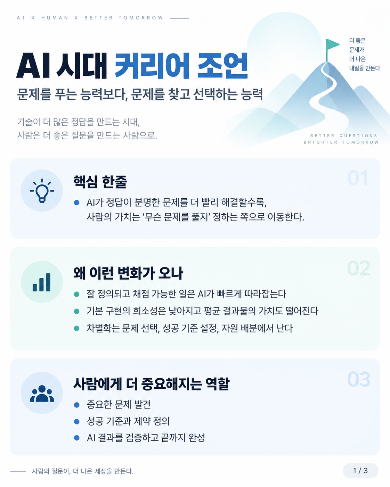
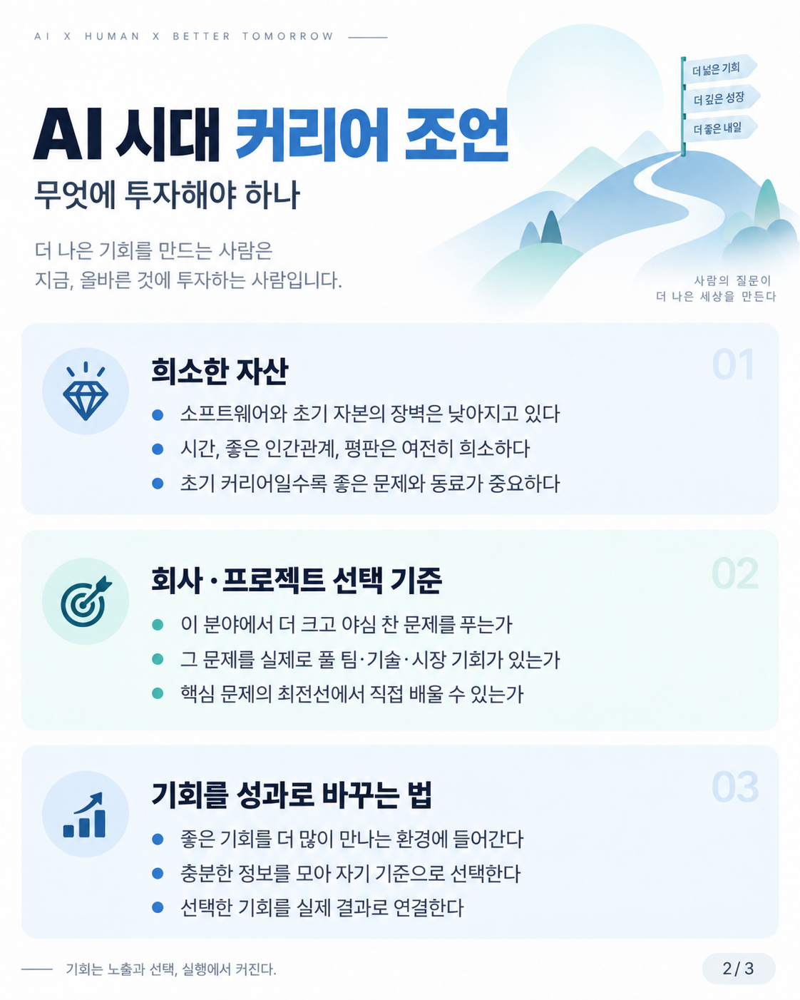
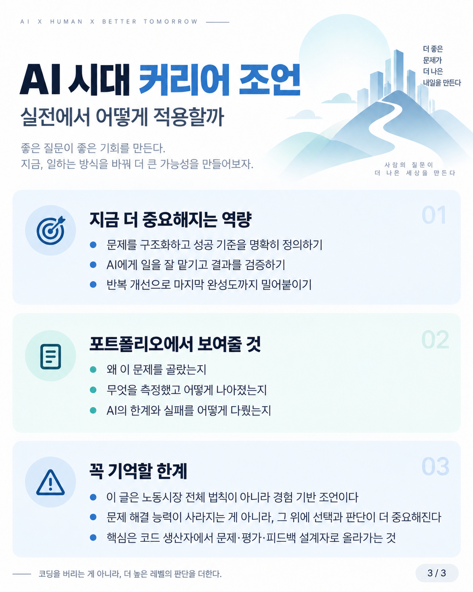

# AI 시대 커리어 조언

AI가 잘 정의된 문제를 빠르게 해결할수록 사람의 차별화 지점이 **문제 발견·선택, 성공 기준 정의, 자원 배분, 검증, 마지막 완성도** 쪽으로 이동한다는 커리어 조언을 3장으로 압축한 가이드다.

## Pages

### 1. 문제를 푸는 능력보다, 문제를 찾고 선택하는 능력

잘 정의되고 채점 가능한 업무의 자동화가 빨라질수록 사람에게 더 중요해지는 역할을 문제 발견, 성공 기준·제약 정의, 결과 검증으로 정리한다.

### 2. 무엇에 투자해야 하나

소프트웨어·초기 자본보다 시간·관계·평판이 더 희소할 수 있다는 관점과, 회사·프로젝트를 고를 때 문제의 야심, 팀·기술·시장 기회, 학습 위치를 함께 보라는 조언을 요약한다.

### 3. 실전에서 어떻게 적용할까

문제 구조화, 성공 기준 정의, 에이전트 위임과 검증, 반복 개선을 실제 역량과 포트폴리오 신호로 연결하고, 이 주장이 노동시장 전체의 확정 법칙이 아니라 경험 기반 조언이라는 한계도 함께 남긴다.

## Status

- Created: 2026-10-07
- Language: Korean
- Format: PNG, 1122×1402
- Pages: 3

## Caveat

이 가이드는 Phil Chen의 개인적 커리어 경험과 에이전트 중심 회사의 채용 관점을 시각적으로 요약한 것이다. 노동시장 전체에서 문제 발견 능력이 문제 해결 능력보다 항상 더 높은 보상을 받는다는 인과 법칙을 증명한 자료는 아니다.

`마지막 10%`, 좋은 관계·평판, 야심 찬 문제 선택 같은 항목은 정량 법칙이 아니라 전략적 휴리스틱으로 읽어야 한다. 배경 원문과 검증 맥락은 `SOURCES.md`를 참고한다.
