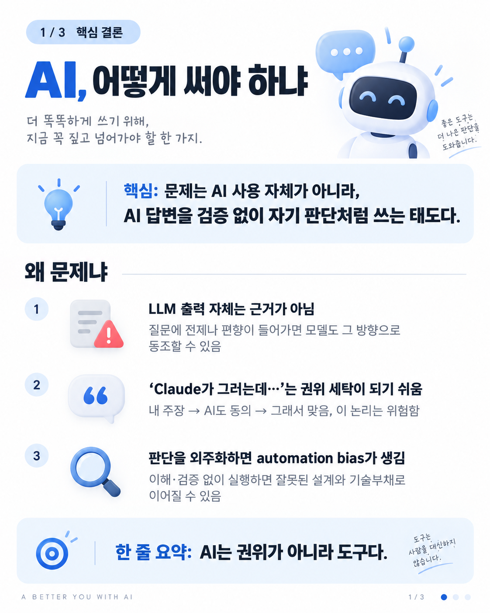
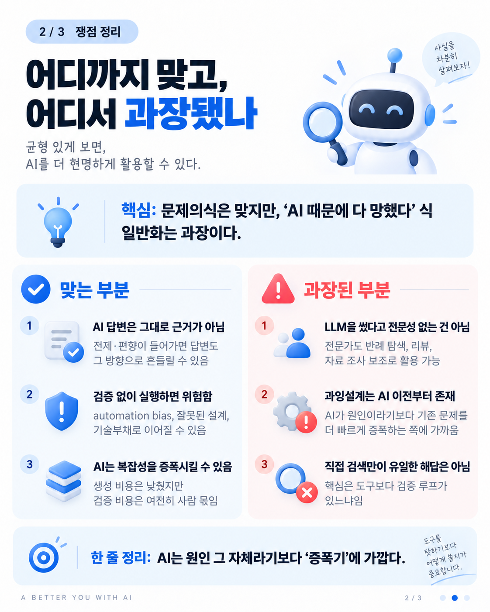
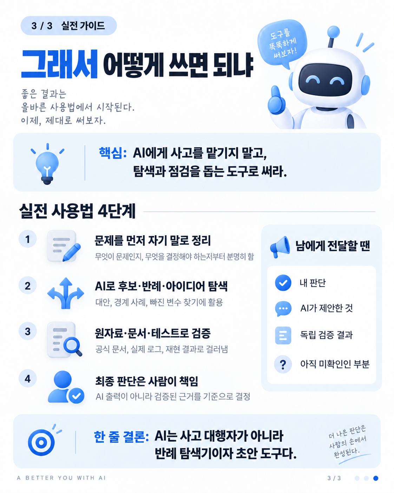

# AI는 권위가 아니라 도구다

`"Claude가 그러는데…"` 식으로 LLM 출력을 권위처럼 전달하는 문제를 출발점으로, **AI 답변의 검증 책임, 과장된 반-AI 일반화, 실전 사용 절차**를 3장으로 정리한 가이드다.

## Pages

### 1. AI, 어떻게 써야 하냐

LLM 출력 자체는 근거가 아니며, 사용자의 전제와 편향이 답변에 반영될 수 있다는 점과 검증 없는 판단 외주화의 위험을 설명한다.

### 2. 어디까지 맞고, 어디서 과장됐나

AI 답변을 검증해야 한다는 문제의식은 인정하되, `LLM 사용 = 전문성 부족`, `AI가 과잉설계의 원인`, `직접 검색만이 해답` 같은 일반화는 분리해서 본다.

### 3. 그래서 어떻게 쓰면 되냐

문제 정의 → 후보·반례 탐색 → 원자료·문서·테스트 검증 → 사람의 최종 판단이라는 실전 사용 루프와, 다른 사람에게 전달할 때 남겨야 할 정보를 정리한다.

## Status

- Created: 2026-10-07
- Language: Korean
- Format: PNG, 1122×1402
- Pages: 3

## Caveat

이 가이드는 원문 에세이와 댓글 논쟁을 그대로 옮긴 것이 아니라, 외부 연구와 개발 생산성 자료를 함께 검토해 만든 **비판적 요약**이다. 특히 `AI는 원인이라기보다 증폭기에 가깝다`는 표현은 DORA 등의 자료를 바탕으로 한 해석이며 원문의 직접 인용이 아니다.
