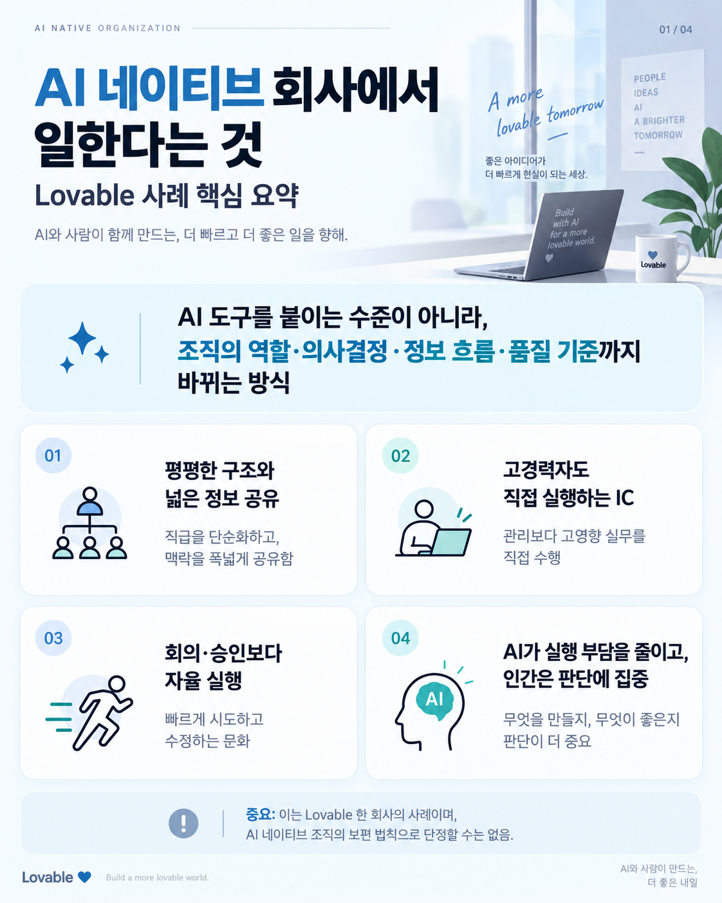
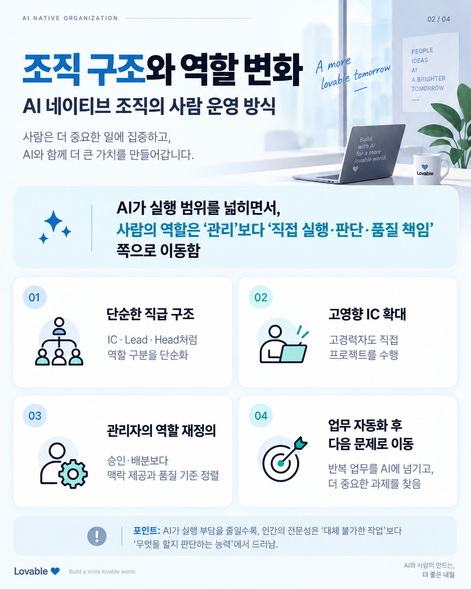
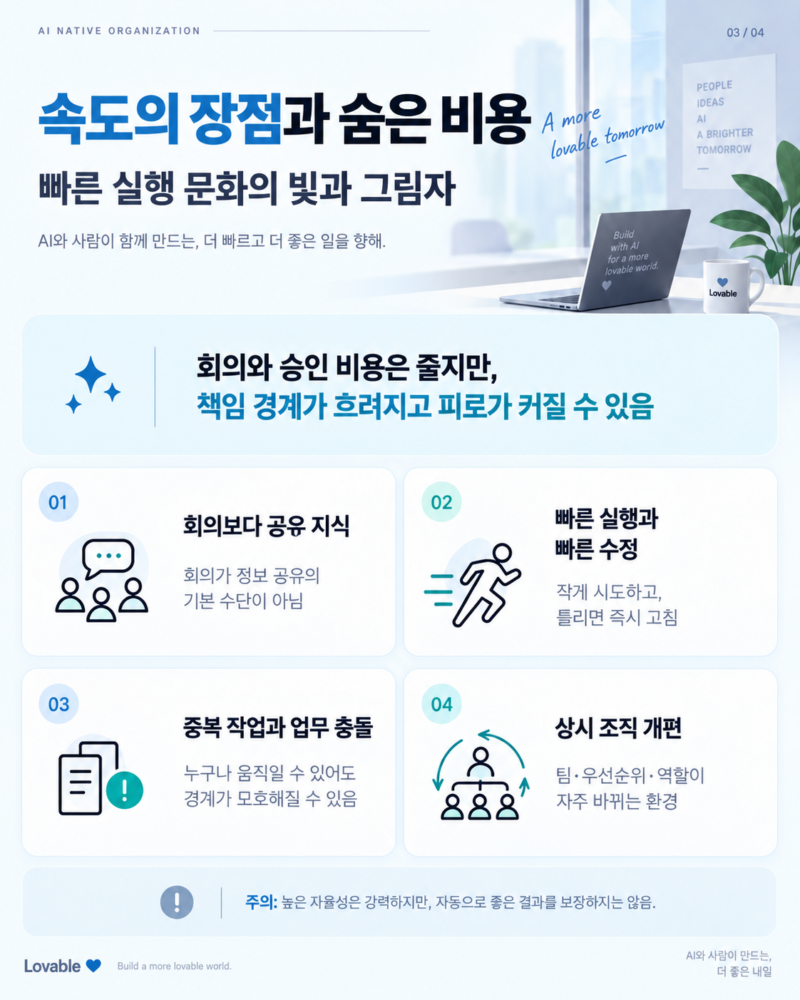
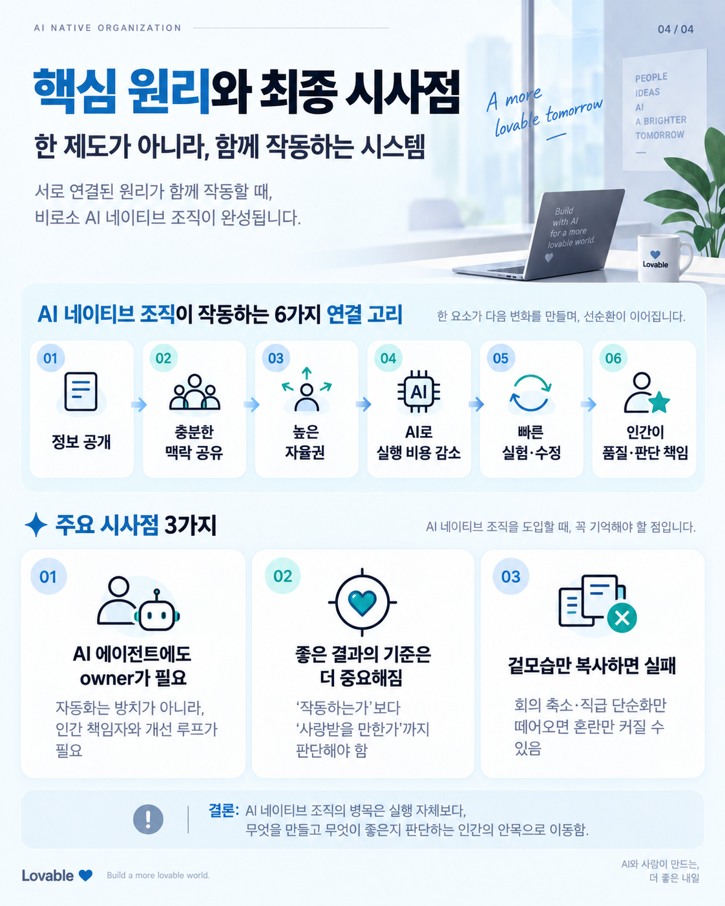

# AI 네이티브 회사에서 일한다는 것

Lovable 사례를 바탕으로 **AI가 개별 업무 생산성을 넘어 조직의 역할, 의사결정, 정보 흐름, 자율성, 품질 책임을 어떻게 바꾸는지** 4장으로 정리한 가이드다.

## Pages

### 1. AI 네이티브 회사에서 일한다는 것

AI 도구 도입을 넘어 평평한 구조, 넓은 정보 공유, 고경력 IC의 직접 실행, 인간의 판단 역할이라는 전체 프레임을 잡는다.

### 2. 조직 구조와 역할 변화

단순한 직급 구조, 고영향 IC, 관리자의 역할 재정의, 반복 업무 자동화 이후 다음 문제로 이동하는 업무 방식을 설명한다.

### 3. 속도의 장점과 숨은 비용

공유 지식과 빠른 실행의 장점뿐 아니라 중복 작업, 업무 충돌, 책임 경계의 모호함, 상시 조직 개편이 만드는 비용을 함께 보여준다.

### 4. 핵심 원리와 최종 시사점

정보 공개에서 자율권, AI에 의한 실행 비용 감소, 빠른 실험과 수정, 인간의 품질·판단 책임으로 이어지는 연결 구조와 도입 시 주의점을 정리한다.

## Status

- Created: 2026-10-07
- Language: Korean
- Format: PNG, 1122×1402
- Pages: 4

## Caveat

이 가이드는 Lovable이라는 한 회사의 경험 사례를 요약한 것이다. AI 네이티브 조직의 보편 법칙이나 과학적으로 확립된 조직 모델로 단정하지 않는다.

