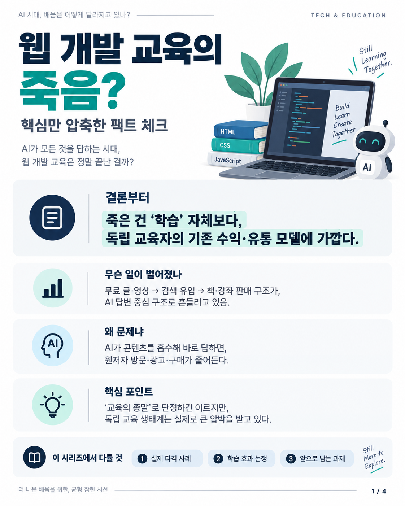
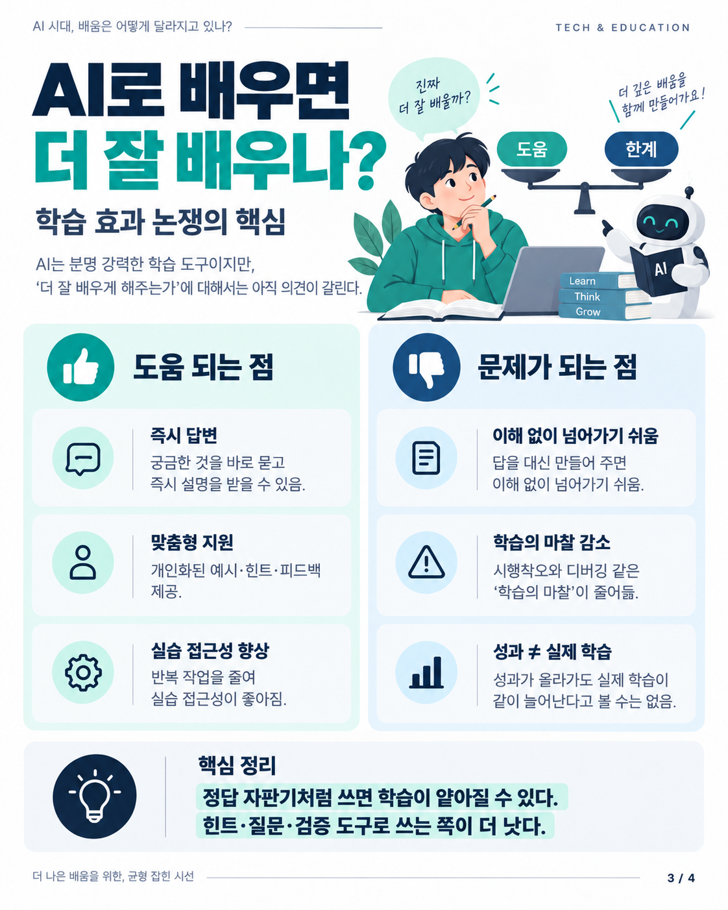
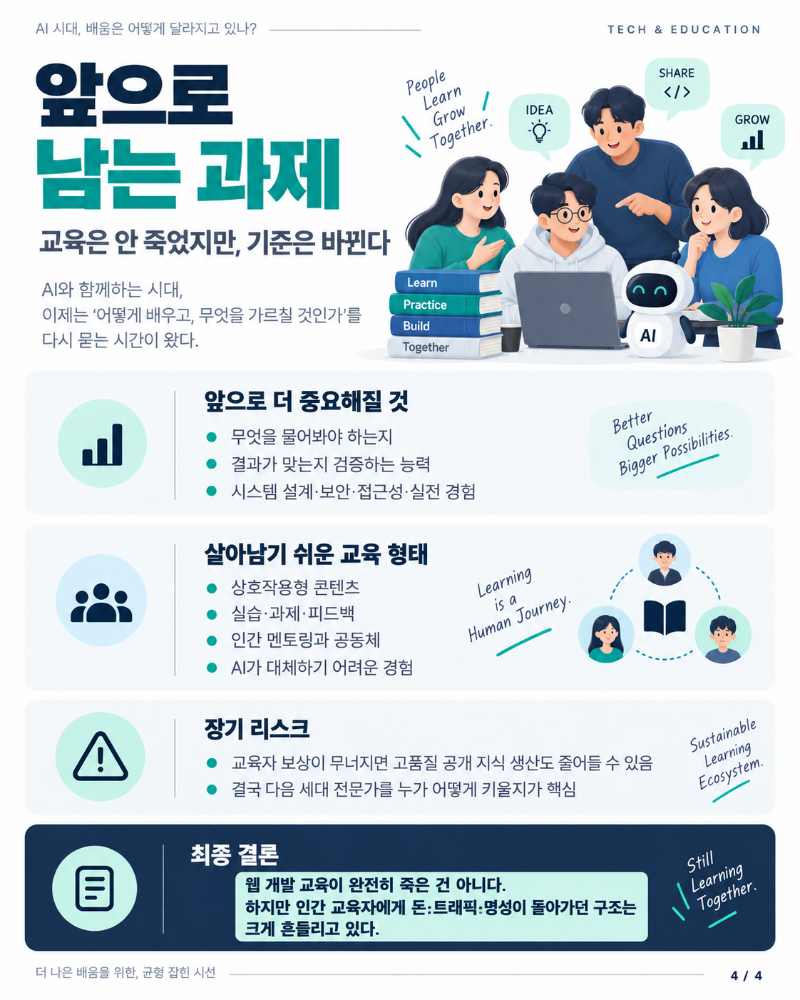

# 웹 개발 교육의 죽음?

생성형 AI가 웹 개발 학습 경로와 독립 교육자의 수익 구조를 어떻게 바꾸고 있는지, **교육 자체의 쇠퇴**와 **기존 콘텐츠 유통·수익 모델의 붕괴**를 구분해 설명하는 4장짜리 가이드다.

## Pages

### 1. 웹 개발 교육의 죽음?

무료 글·영상에서 검색 유입을 거쳐 책·강좌 판매로 이어지던 구조가 AI 답변 중심으로 흔들리고 있다는 전체 프레임을 잡는다.

### 2. 실제 타격 사례

Axel Rauschmayer, Josh W. Comeau, Web Dev Simplified, Salma Alam-Naylor의 공개 사례를 통해 독립 개발 교육자의 매출·트래픽·활동 지속성 압박을 정리한다.

### 3. AI로 배우면 더 잘 배우나?

즉시 답변·개인화·실습 접근성이라는 장점과, 이해 없는 진행·학습 마찰 감소·성과와 실제 학습의 분리 가능성을 함께 설명한다.

### 4. 앞으로 남는 과제

검증 능력, 시스템 설계와 실전 경험, 상호작용형 교육, 인간 멘토링과 공동체의 가치를 중심으로 앞으로의 교육 기준을 정리한다.

## Status

- Created: 2026-10-07
- Language: Korean
- Format: PNG, 1122×1402
- Pages: 4

## Caveat

이 가이드의 교육자 매출·수입 사례는 당사자의 공개 발언과 이를 인용한 원문을 바탕으로 한다. 업계 전체의 감사된 매출 통계나, 감소분 전부가 생성형 AI 때문에 발생했다는 인과 추정치는 아니다.

이미지 안의 말풍선·인용부호 형태 문구 일부는 핵심 취지를 압축한 **시각적 요약 문구**이며, 직접 인용문으로 사용하면 안 된다. 근거와 원문은 `SOURCES.md`를 참고한다.
